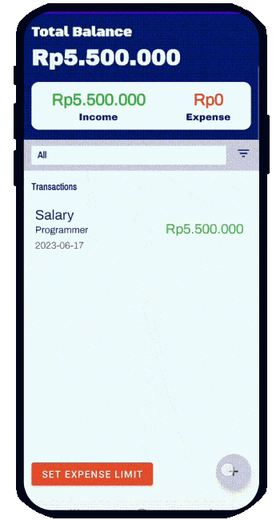
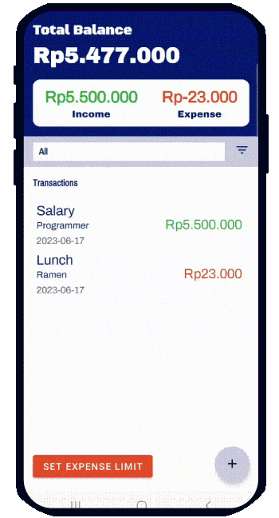
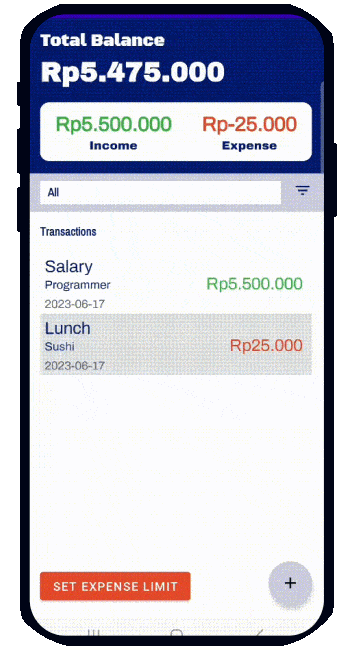

# Finance Tracker Mobile in Java 💶
This project showcases a simple finance tracker application made with Java programming language. This app helps you to manage your personal finances. It keeps track on your expense and income. In this app, we implemented Create-Read-Update-Delete (CRUD) concept. Several features that you can experience are:
* *Create transaction*<br/><br />You can add new transaction (income/expense) by clicking the plus button on the bottom right corner. Then, the "add transaction" page will be opened. In this page, you should provide the label, amount, and category of the transaction. The description is an optional part. After all required fields are filled, the transaction will be shown on the list at the homepage.
* *Read transaction (filter by selected date range)*<br /><br />All transactions can be viewed on the homepage. The header of the homepage is the dashboard that shows the current balance, total income, and total expense. In addition, you may view some transactions from specific range of date through the filter below the dashboard. If the filter icon is clicked, it will open a calendar page. In this page, you can pick the desired start date and end date. After you click save, transactions within the date range will be shown on the transaction list.
* *Update transaction*<br /><br />This feature enables you to modify a transaction after it has been created. Fields such as label, amount, description, and category, can be easily modified by clicking on the transaction item from the list. The "Edit Transaction" page will be shown and you may edit the value on each field, then click the button on the bottom to save the updated data.
* *Delete transaction*<br /><br />Deleting a transaction can be easily done by swiping the transaction item to the right.

**View the app demo in here: [Click Here](https://www.canva.com/design/DAFkxGRXDAA/EKrX3QD_lTT5LV3HC9uA4A/view?utm_content=DAFkxGRXDAA&utm_campaign=designshare&utm_medium=link&utm_source=publishsharelink](https://angeline-mary-marchella.notion.site/Finance-Tracker-218531c3cec1496e9378fd853b692155?pvs=4))**
## Platforms and Libraries
Since this is an Android application, we used [`Android Studio`](https://developer.android.com/studio?gclid=CjwKCAjwpuajBhBpEiwA_ZtfheMV-FhB4RZOHrGrzi_mPgiUudqZsvKb98tI1N4DSrbsDh1-oJeqNRoC94wQAvD_BwE&gclsrc=aw.ds) as the main platform to integrate the frontend and backend of our application. To create the user interface, `.xml` files are created for each activity (page). Besides using several built-in libraries, [`Material.io`](https://m3.material.io/) library is also implemented to create some components in this app, such as dashboard cards, add button, etc. Specifically, the library version that we imported in `build.gradle` file is `com.google.android.material:material:1.4.0-alpha02`. This program  also use SQLite database to store the transactions

## How to Run the Application
### Run the application locally
* Clone the repository
  Run the following command to clone this repository
  ```
  git clone https://github.com/angelinemarym/Finance-Tracker-Mobile-Java.git
  ```
* Install [`Android Studio`](https://developer.android.com/studio?gclid=CjwKCAjwpuajBhBpEiwA_ZtfheMV-FhB4RZOHrGrzi_mPgiUudqZsvKb98tI1N4DSrbsDh1-oJeqNRoC94wQAvD_BwE&gclsrc=aw.ds)
  <br />Install [`Android Studio`](https://developer.android.com/studio?gclid=CjwKCAjwpuajBhBpEiwA_ZtfheMV-FhB4RZOHrGrzi_mPgiUudqZsvKb98tI1N4DSrbsDh1-oJeqNRoC94wQAvD_BwE&gclsrc=aw.ds) and do the configuration. Also, do not forget to create an emulator to run the application later.
* Run the app <br />
   Once your device or emulator is ready, click on the`Run` button (a green play button) in the toolbar or select `Run` > `Run 'app'` from the top menu. Android Studio will build the app and deploy it to the connected device or emulator.
### Run the application from your mobile phone
* Install the `.apk` file on your device <br/>
  After the `.apk` file is installed, you can open the app and explore the features.
